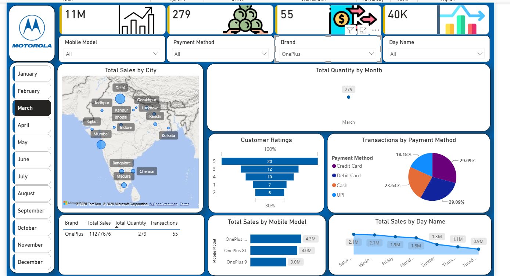

# Mobile Sales & Competitive Intelligence Dashboard

## Project Overview

This project showcases an interactive Power BI dashboard designed for mobile sales analysis and competitive intelligence.

The dashboard simulates an internal Motorola business reporting solution, enabling stakeholders to monitor sales performance, customer behavior, payment preferences, and competitor performance across major smartphone brands.

---

## Key Features

### Sales Performance

* KPI Cards for Total Sales, Quantity Sold, and Transactions
* Monthly and Daily Sales Trend Analysis
* Sales Distribution by City using an interactive map

### Customer Insights

* Customer Ratings Analysis
* Payment Method Breakdown
* Sales Patterns by Customer Preferences

### Competitive Intelligence

* Brand-wise Sales Comparison
* Competitor Benchmarking across Apple, Samsung, Xiaomi, Vivo, and OnePlus
* Comparative performance tables and visualizations

---

## Tech Stack

* Power BI
* Power Query
* DAX
* Data Modeling

---

## Dashboard Preview

---

## Author

Ramadugu Nagendra Chari

AI Engineer | LLM Training & Evaluation | Agentic Workflows | Analytics, Automation & Systems Thinking

LinkedIn: [Ramadugu Nagendra Chari](https://www.linkedin.com/in/ramadugu-nagendra-chari-60199b225/)

GitHub: [Ramadugu Nagendra Chari](https://github.com/NagendrachariRamadugu/)
